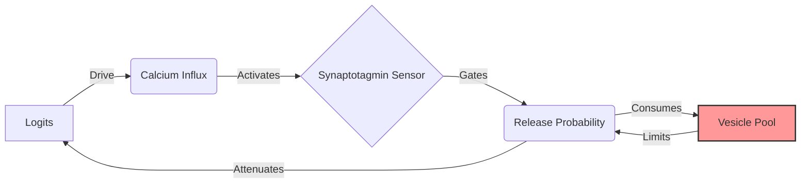
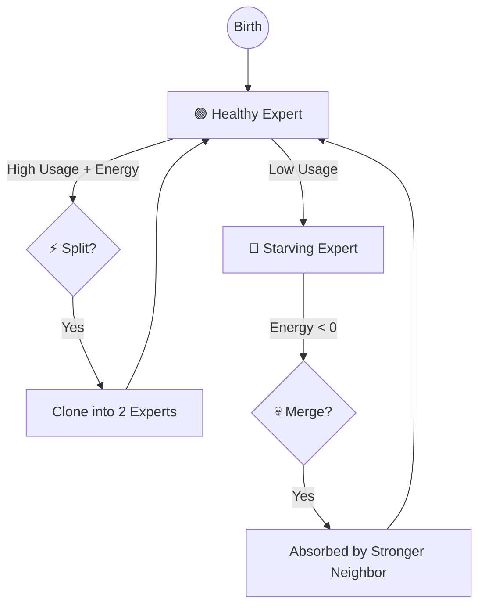

# Bio-Inspired Nanochat

> **"What if a Transformer had a metabolism?"**

[](https://www.python.org/downloads/)
[](https://pytorch.org/)
[](./LICENSE)

This is a research fork of [Nanochat](https://github.com/karpathy/nanochat) that replaces standard static weights with **computational analogs of synaptic proteins**, implementing biologically-grounded mechanisms for working memory, attention modulation, and neural architecture search.

Standard LLMs are "frozen crystals"—static matrices of `float16` numbers that never change once training is done. **Bio-Inspired Nanochat** is a "living fluid". Its connections grow, shrink, fatigue, recover, and even reproduce *during inference*, mimicking the energy-constrained efficiency of the biological brain.

## 📊 Project Status

This is an **active research project** implementing 11+ bio-inspired mechanisms with systematic evaluation and optimization. See our comprehensive planning documents:

- 📋 [**Full Roadmap**](.beads/) - 476 issues across 33 epics in the Beads tracker (`br ready --json` lists claimable work)
- 🧬 [**CMA-ES Optimization Plan**](PLAN_TO_USE_CMAES_FOR_HYPERPARAMETER_EXPLORATION_AND_OPTIMIZATION_ACROSS_ALL_BIO_INSPIRED_FEATURES.md) - Systematic hyperparameter tuning (10 params wired in Phase 1; ~48 planned across two phases)
- 🎯 [**Feature Predictions**](CLAUDE_SONNET45_PREDICTIONS_ON_WHICH_NEW_BIO_INSPIRED_IDEAS_WILL_WORK_BEST_OR_NOT.md) - Evidence-based analysis of which mechanisms will work
- 🚀 [**New Features Roadmap**](NEW_RADICALLY_NEW_BIO_INSPIRED_FEATURES_TO_ADD_IN_MODULAR_WAY.md) - Detailed specs for upcoming mechanisms

**Implementation Status:**
Status legend: ✅ shipping (on the live model path, tested) · 🚧 partial/landing · 🔮 aspirational (roadmap).

**Evidence status (2026-09-01):** everything marked ✅ below is implemented on the live path and unit-tested — at toy scale (≤ 2 layers × 64 dims, synthetic tokens, CPU). No model has yet been trained on a GPU or on real text under version control, and no bio-vs-vanilla comparison at language-model scale exists; `results/registry.jsonl` has no `val_bpb` row. The pre-registered experiment that produces that signal is [`docs/ablation_matrix.md`](docs/ablation_matrix.md) (beads `hwxb.3`–`hwxb.6`), gated on the dual-RTX-4090 host. At toy scale the two directional results so far are null-to-negative: online fast-weights ON vs OFF are indistinguishable ([`docs/online_learning_status.md`](docs/online_learning_status.md); measured in a regime that could not see the mechanism, so this is unmeasured rather than null until bead `hwxb.9` runs) and split/merge NAS regressed loss on 8 of 8 seeds (`results/structural_nas_evaluation_a2307f21b18f.json`; re-derived 2026-09-02 under deterministic evaluation with identical numbers, `results/structural_nas_evaluation_2026-09-02_product.json`). The synaptic path is also 4–18× slower than vanilla on CPU (`results/perf_baselines.json`). Treat the mechanism list as "built", not "shown to help".

- ✅ **Core Synaptic Mechanisms** — presynaptic release (faithful Hill dynamics), online Hebbian fast-weights, and the structural MoE lifecycle all run on the live path.
- ✅ **Stochastic release · BDNF metaplasticity · dual fast/slow weights** — implemented and toggleable.
- 🚧 **Triton GPU & Rust CPU kernels** — one toggle, `native_presyn`, dispatches the deterministic FP32 one-query decode step to the Triton kernel on CUDA (never yet executed on a GPU; 4090 acceptance is bead `3bnd`) and to the parity-locked Rust kernel on CPU (`tests/test_presyn_rust_dispatch.py`). Measured on CPU the Rust step is ~2× faster than PyTorch at ≤512 keys and no faster at 2k+ keys, so the toggle stays off by default.
- 🚧 **Systematic Optimization** — CMA-ES Phase 1 (the 10 most influential params) is wired; the broader ~48-param two-phase search is planned.
- 🚧 **Rigorous Evaluation** — the statistical layer (paired t / Wilcoxon, bootstrap + Student-t 95% CIs, multi-seed aggregation) ships in `bio_inspired_nanochat/eval_stats.py`; the full benchmark-matrix *run* is still pending.
- ✅ **Fail-closed certificate-policy model cards** — `certificate_bundle.py` strictly composes declared-identity stability, retention, predictive-calibration, tropical-radius, and configured-timescale evidence into a bounded same-process authorization; serialized manifests are audit/report inputs only and cannot recreate live runtime attestation. Well-formed failed, stale, fallback-covered, or out-of-scope evidence is rendered transparently and refused; malformed input is rejected before artifacts are created. No passing production-model card is bundled. See [`docs/certified_model_card.md`](docs/certified_model_card.md).

---

## ⚔️ Tale of the Tape: Silicon vs. Carbon

| Feature | Standard Transformer | Bio-Inspired Nanochat |
| :--- | :--- | :--- |
| **Weights** | 🧊 **Static**: Fixed after training. | 🌊 **Fluid**: Evolve in real-time during inference. |
| **Memory** | 📜 **Context Window**: Limited by `seq_len`. | 🧠 **Associative**: Fast-weights "remember" patterns locally. |
| **Diversity** | 🎲 **Randomness**: Temperature sampling. | 🔋 **Metabolism**: Synapses "tire out", forcing new paths. |
| **Capacity** | 🏗️ **Fixed**: Pre-allocated size (e.g., 32 layers). | 🏙️ **Elastic**: Experts multiply/die based on demand. |
| **Learning** | 🏫 **Offline**: Only learns during Backprop. | ⚡ **Online**: "Learns" context via Hebbian consolidation. |
| **Optimization** | 🎯 **Grid Search**: Manual hyperparameter tuning. | 🧬 **Evolution**: CMA-ES tunes the bio parameters (10 wired in Phase 1). |
| **Kernels** | 🐍 **Python/CUDA**: Single backend. | ⚡ **Reference + experimental kernels**: canonical PyTorch plus default-off FP32 Triton decode and a parity-locked Rust CPU decode kernel. |

---

## 🧠 The "Wetware" Stack: From Biology to Math

We map specific cellular mechanisms from the [Synaptic Cleft](https://en.wikipedia.org/wiki/Chemical_synapse) directly to tensor operations. This architecture is grounded in neuroscience literature and the blueprints found in `prompts/`.

### 1. Presynaptic Biophysics (The Sender)
*The mechanism of "Fatigue" and "Boredom"*

**The Biology**: Neurons run on batteries (ATP). If a neuron shouts too much (fires continuously), it runs out of neurotransmitter vesicles (chemical ammo). It *must* rest to reload.

**The Math**: We track a fluid reservoir `RRP` (Readily Releasable Pool) for every attention head. High attention scores drain the pool.

**The Effect**: A physically-grounded **frequency penalty**. The model literally *cannot* attend to the same token endlessly. It gets "bored" (depleted) and naturally shifts focus to novel information.

**Implementation**: the canonical model path is `SynapticPresyn.release_canonical` (pure PyTorch, differentiable, golden-locked in `tests/test_presyn_golden.py`). A default-off Triton backend implements an intended acceleration for its deterministic FP32 one-query CUDA decode slice at the configured top-k width; unsupported modes retain the canonical Python path. The same frozen decode trajectory is exercised by Python, Triton's CPU interpreter/CUDA path, and a Rust CPU landing kernel in `tests/test_presyn_backend_parity.py`:
- **Triton GPU Kernel** (`bio_inspired_nanochat/kernels/presyn_fused.py`): live FP32 `Tq=1` deterministic decode fusion; RTX 4090 acceptance pending.
- **Rust CPU Kernel** (`rust_src/src/presyn.rs`): PyO3-native canonical deterministic decode step; `release_canonical` dispatches to it for eval-mode one-query CPU decode when `native_presyn=1` (opt-in; measured speed in the kernel section below).



### 2. Postsynaptic Density (The Receiver)
*The mechanism of "Working Memory"*

**The Biology**: "Neurons that fire together, wire together." A transient thought becomes a memory only if it is important (high activity) and the brain has energy to "write" it down (Consolidation).

**The Math**: Weights are split into $W_{slow}$ (Long-term) and $W_{fast}$ (Short-term).
$$ y = x(W_{slow} + \underbrace{W_{fast} + \text{Hebb}(x, y)}_{\text{The Scratchpad}}) $$

**The Effect**: **Infinite local context**. The model can define a variable at the start of a sentence and "remember" it at the end via the fast weights, without needing to attend back to it.

**Mechanisms**:
- ✅ **BDNF Metaplasticity**: activity-dependent learning-rate modulation — on by default with gain `1 + bdnf_scale·BDNF`; set `bdnf_scale=0` to ablate, or `bdnf_gamma>0` to override the gain.
- ✅ **Dual-Weight Differentiation**: separate fast-cache vs slow-storage timescales (`W_fast` / `W_slow`).
- ✅ **CaMKII/PP1 Bistable Latch** (opt-in via `bistable_latch`, `sax.2`): a Lisman-style switch — CaMKII autophosphorylation (Hill self-excitation) + mutual cross-inhibition with PP1 over a basal phosphatase floor — with PP1 folded into the consolidation gate. Gives genuine **hysteresis**: a supra-threshold pulse latches the synapse ON and it *stays* after the input drops; sustained LTD flips it OFF (tested in `tests/test_bistable_latch.py`). Default-off keeps the legacy CaMKII threshold gate.

### 3. Structural Plasticity (The Life Cycle)
*The mechanism of "Economy & Efficiency"*

**The Biology**: The brain is a ruthlessly efficient economy. It doesn't keep billions of idle neurons on payroll. Useful regions get more resources (Neurogenesis); idle regions are demolished (Pruning).

**The Math**: A **Synaptic Mixture-of-Experts (MoE)** with a per-expert **energy metabolism** and a **health-based lifecycle** (health = utilization × energy). The "bank-account" framing below is a metaphor for these real mechanisms (there is no literal accounting/`bankruptcy`/`IPO` code):
*   **Energy cost** ("taxation"): firing draws down an expert's energy (`energy_use`); idling lets it refill (`energy_fill`).
*   **Utilization** ("income"): being routed raises utilization, which feeds the health score.
*   **Merge** ("bankruptcy"): persistently low-health experts are merged into stronger neighbors.
*   **Split** ("IPO"): high-health experts clone into weak slots.

These events are **function-preserving** (Net2Net / firefly, `sm_function_preserving=1`, default on): a split makes the destination an exact clone of the parent and gives both a `-ln2` routing-logit bias, so the twins jointly reproduce the parent's routing mass (each fires with half the gate) while antisymmetric `fc1` noise lets them diverge under SGD. In the **dense** regime (`top_k == num_experts`) the model output is unchanged at the event; in sparse top-k the discontinuity is sharply reduced (≈10–40× gentler than the legacy noisy clone in tests) but not zero, since moving a twin pair across the top-k boundary is inherently discrete. Set `sm_function_preserving=0` for the legacy noisy-clone behavior.

When `use_neuroscore` is enabled, NeuroScore fitness (below) is blended into that health signal so credit assignment — not just utilization × energy — drives these decisions.

When `homeostasis_guards` is enabled (`SplitMergeConfig`, default off, `uta.6`), every lifecycle event additionally stabilizes the touched experts: a freshly seeded slot ramps its routed mass in from ~zero over `gate_ramp_forwards` training forwards with exact pair-mass compensation (the dense-regime output stays preserved throughout the transient, not just at the event), per-expert energy is held at or above `energy_floor` so a collapsed metabolism cannot produce winner-take-all routing, and optimizer moments are reset only for the *changed rows* of the shared router/genome tensors — a short warm restart for touched experts that leaves everyone else's AdamW/Muon state intact.

**The Effect (intended)**: **Neural Architecture Search**. The model starts small and *grows* capacity exactly where the data complexity demands it.

**Measured (2026-09-01, toy scale):** the health signal does not yet support that story. Utilization is the routed-token fraction, so a uniformly used expert sits at `top_k / num_experts`, while the thresholds are absolute: at 4 experts nothing ever fires (health ≈ 0.3 sits between the merge and split thresholds), and at the 8-expert default every expert is a merge candidate on every check. Because energy relaxes toward `1 − utilization`, health ≈ `u(1 − u)` at steady state and peaks at half the routing mass, so a monopolising expert reads as *dead* and the split threshold of 0.80 is unreachable for any expert count. A scale-free alternative ships default-off: `--sm_health_mode=relative` scores each expert by utilization relative to the fair share `top_k / num_experts` (1.0 = uniform, >1 overworked, <1 underused), with the three thresholds then given in those units (e.g. `--split_health_min=1.5 --merge_health_max=0.35 --reset_health_max=0.05`). Whether lifecycle events *help* under either signal is still the open question on bead `sx1m`; until it is answered, treat the lifecycle as an opt-in study, not a working capacity allocator.



### 4. Neuromodulation (Global State)

*The mechanism of "Context-Dependent Gating"*

**The Biology**: Real plasticity is gated by a few **global neuromodulators** broadcast brain-wide. Dopamine (DA) signals reward-prediction error; acetylcholine (ACh) signals uncertainty/attention; norepinephrine (NE) signals arousal/novelty.

**The Math** (`hy8.1`, `NeuromodulatoryBus`; opt-in via `--neuromod_enabled=1` or `--syn_cfg.neuromod_enabled=1`, and registered as the `neuromod` ablation mechanism so the pre-registered matrix carries an `add_neuromod` column): three scalars are computed each step from model signals (loss-improvement → DA, predictive entropy → ACh, loss-surprise → NE), EMA-smoothed, and **broadcast** as multiplicative gains onto every synapse:
*   **DA → plasticity gain**: scales the online Hebbian consolidation, so only reward-relevant / loss-reducing updates stick. This is the third factor that bridges Hebbian plasticity to RL (`hy8.2`).
*   **ACh → exploration & attention** (`hy8.5`): scales the stochastic vesicle-release fraction AND an input/attention gain — more uncertainty, more exploration and sharper input sensitivity; the model commits when confident.
*   **NE → global gain / reset**: scales the synaptic output and, on a surprising event, flushes the per-sequence working memory.

Default-neutral (gains 1.0) when off, so it's a no-op unless enabled; telemetry exposes all three levels and gains per step.

### 5. Calibrated Uncertainty and Selective Decoding

*The mechanism of "Know When to Think More—or Not Answer"*

`mc_predict` can sample inference-time stochastic vesicle release and return a predictive distribution with entropy, aleatoric/epistemic decomposition, and logit variance. The mode is opt-in and restores model/synaptic state after sampling. In the canonical 10-seed calibration run — a 1-layer, 32-dim model on a synthetic task, i.e. a pipeline demonstration rather than a language-model result — synaptic MC improved ECE by 34.74% versus MC-dropout and its OOD-AUROC lower 95% confidence bound was 0.9895; it did **not** outperform the free softmax-entropy baseline (ΔECE ≈ 4e-6), and the artifact records its own verdict as `null`.

The default-off `UncertaintyDecodingConfig` turns that measured entropy into an action. `quality_guarded_predict` first routes an uncertain cheap prediction to the reserved full-compute path; if the served distribution remains above a threshold calibrated in nats, it returns an auditable `abstain` or `clarify` directive instead of a token. Every decision logs the adaptive/served entropy, threshold crossings, action trace, bounded predictive-distribution summary, compute plan, and exact ATP debits. On the tiny canonical selective-prediction artifact, the first ≥80%-coverage point per seed retained 770/960 predictions while reducing served errors from two to zero; this is a deterministic demo, not a portable production threshold.

See `docs/theory/stochastic_thermodynamics.md` §§7.4–7.5 and `results/calibration-selective-prediction-86aad7037a51.json` for the full statistical and risk-coverage evidence.

---

## 🚀 Advanced Bio-Inspired Features (Roadmap)

Beyond the core mechanisms, we're systematically implementing 11 additional biologically-grounded features:

### Ready for Implementation
1. **Stochastic Vesicle Release** - Binomial/Gumbel-Sigmoid stochastic path with STE for training
2. **Vesicle Endocytosis Ring Buffer** - Delayed refill with optional Rab5/7 staging
3. **Septin-Style Lateral Inhibition** - Windowed inhibition on logits/router for sharpening

### In Research Phase
4. **Rab/SNARE Code-Based Routing** - Token cargo codes vs expert t-SNARE compatibility
5. **Doc2 Dual Sync/Async Channels** - Parallel Syt1 (fast) and Doc2 (slow) release paths
6. **Synaptic Genome Embedding** - Implemented low-dim Xi per expert decoded to kinetic parameters
7. **CaMKII/PP1 Bistable Latch** - Hill-term ODE with hysteresis for consolidation
8. **Cellular Automata Initialization** - Rule 30/116 variance-corrected weight init

**Synaptic Genome Embedding (Xi):** Each MoE expert owns a compact learned genome vector `Xi` (size `SynapticConfig.xi_dim`). One shared learned decoder maps each 4-D row to six bounded phenotype values: fatigue and energy-recovery rates, CaMKII/PP1 gains, calcium retention, and calcium influx. The bounds imply positive `tau_c` and `tau_rec`, so SGD cannot decode invalid kinetics. This keeps the expert-specific parameter cost at `O(num_experts · xi_dim)` rather than `O(num_experts · num_kinetics)`. Set `xi_dim=0` for the registered `bio_no_genome` control: the decoder bias still learns one phenotype, but every expert shares it.

### Experimental
9. **Cross-Pollination with Gauge-Reversible Networks** - Integration of measure-preserving ideas
10. **Simplicial/Higher-Order Attention** - k-body interactions beyond pairwise
11. **Ultrametric Routing** - Hierarchical expert organization


**Evidence path per feature** (checked against `ablation_registry.MECHANISMS` and the import graph,
2026-09-02; bead `74f.9`). A D1 column means the pre-registered matrix (`docs/ablation_matrix.md`)
measures the feature's effect once the GPU run happens; "exploratory" means no efficacy evidence is
planned and none should be inferred.

| # | Feature | Switch | Evidence path |
|---|---|---|---|
| 1 | Stochastic vesicle release | `SynapticConfig.stochastic_train_frac` (mechanism `stochastic_release`, default on) | D1 leave-one-out column `bio_no_stochastic_release` |
| 2 | Endocytosis ring buffer | the DELAY queue inside the presynaptic recurrence; no separate switch. Rab5/7 staging is not implemented | only through `bio_no_presyn` (inseparable from presyn) |
| 3 | Septin-style lateral inhibition | `SynapticConfig.barrier_strength` (mechanism `septin_barrier`, default on); implemented as a global distance barrier, not a windowed inhibition | D1 column `bio_no_septin_barrier` |
| 4 | Rab/SNARE code-based routing | not implemented (no code) | none — roadmap only |
| 5 | Doc2 dual sync/async channels | `SynapticConfig.doc2_gain` (mechanism `doc2`, default on) | D1 column `bio_no_doc2` |
| 6 | Synaptic genome embedding (Xi) | `SynapticConfig.xi_dim` (mechanism `genome`, default on) | D1 column `bio_no_genome` |
| 7 | CaMKII/PP1 bistable latch | `SynapticConfig.bistable_latch` (opt-in) | D1 column `add_bistable_latch` |
| 8 | Cellular-automata initialization | `--init_type` in `base_train` / `--init-type` in `eval_matrix` (a training-recipe knob, not a mechanism) | exploratory; the numbers in `docs/ca_init_decision.md` cite artifacts that are not in the repository |
| 9 | Gauge-reversible cross-pollination | research modules (`separation_gauge.py`, `ultrametric_memory.py`) that `GPTSynaptic` does not import | exploratory, off the live path |
| 10 | Simplicial / higher-order attention | research modules (`mgr_variants.py`, `xpoll.py`) that `GPTSynaptic` does not import | exploratory, off the live path |
| 11 | Ultrametric routing | opt-in `attention_type="ultrametric"` on the vanilla `GPT` (`gpt.py`); not part of `GPTSynaptic` | exploratory; no bio-matrix column (it is not a synaptic mechanism) |

Each feature is:
- 📝 **Documented** with biological rationale, implementation plan, and success criteria
- 🧪 **Testable** via ablation studies and statistical validation
- ⚙️ **Toggleable** via `SynapticConfig` flags where a flag exists (items 1–3 and 5–7 above; item 4 is unimplemented, 8 is a recipe knob, 9–11 are research modules off the live path), with a registry + validator (`bio_inspired_nanochat/ablation_registry.py`) that defines every mechanism's ablation knob and rejects silently-broken configs (e.g. an opt-in mechanism enabled without its prerequisite)
- 📊 **Benchmarked** against vanilla transformers with rigorous metrics

See [NEW_RADICALLY_NEW_BIO_INSPIRED_FEATURES_TO_ADD_IN_MODULAR_WAY.md](NEW_RADICALLY_NEW_BIO_INSPIRED_FEATURES_TO_ADD_IN_MODULAR_WAY.md) for detailed specifications.

---

## 🔬 Deep Dive: The Math of the Synapse

For the researchers, here are the governing equations implemented in `synaptic.py` and `neuroscore.py`.

> **These are the *live* equations.** As of the presyn unification (`8j9.2`), the model's
> attention path runs `SynapticPresyn.release_canonical`, which implements exactly the faithful
> dynamics below — closing the long-standing gap where these equations were documented but the
> live code used a cheaper sigmoid approximation.

### 1. Calcium Dynamics (The Integrator)
Calcium $C$ acts as a leaky integrator of the incoming attention signal (Logits $L$), coupled to a fast calcium **buffer** $B$ (a parvalbumin/calbindin analog that absorbs and re-releases calcium).

$$ C_{t} = e^{-1/\tau_c} \cdot C_{t-1} + \alpha_{ca} \cdot \text{softplus}(L_t) - \alpha_{on} C_{t-1}(1 - B_{t-1}) + \alpha_{off} B_{t-1} $$
$$ B_{t} = e^{-1/\tau_b} \cdot B_{t-1} + \alpha_{on} C_{t-1}(1 - B_{t-1}) - \alpha_{off} B_{t-1} $$

### 2. The Release Probability (The Gate)
The probability $P_{release}$ that a vesicle is actually released depends on the Calcium level (detected by Synaptotagmin) versus the clamp (Complexin).

$$ P_{release} = \sigma(3 \cdot \text{Syt}(C) + 2 \cdot P_{primed} - 2 \cdot \text{Complexin}) \cdot \sigma(\text{Logits}) $$

Where $\text{Syt}(C)$ is a Hill equation modeling the calcium sensor's sensitivity (Syt1 fast + Syt7 slow, plus a Doc2 facilitation term):
$$ \text{Syt}(C) = 0.7\frac{C}{C + K_{d,\text{fast}}} + 0.3\frac{C}{C + K_{d,\text{slow}}} + g_{\text{doc2}}\,\sigma(4(C - 0.12)) $$

### 3. Vesicle Release & Depletion (The Limiter)
The released amount is the release probability scaled by the available vesicles in the Readily Releasable Pool ($RRP$). Since $P_{release}\in[0,1]$, this is bounded by the pool ($R_t \le RRP_t$) — the faithful reading of $W_{eff}=\min(P,RRP)$.

$$ R_t = P_{release} \cdot RRP_t $$
$$ RRP_{t+1} = RRP_t - R_t + \text{RefillRate} $$

The released signal is then scaled by an energy-gated AMPA amplitude $q = \sigma(\beta_q (E - 0.5)) \cdot q_{max}$ and biased by a septin-like distance barrier. This non-linear depletion is what physically enforces the frequency penalty.

### 4. Hebbian Learning (Fast Weights + Gated Consolidation)
Low-rank eligibility traces $U, V$ accumulate co-activity each step. Fast weights decay and absorb the trace (the short-term scratchpad). Consolidation into the slow weights is gated by CaMKII and modulated by BDNF metaplasticity:

$$ \Delta W_{slow} = \eta_{slow}\,(1 + \gamma\,\text{BDNF})\,\overline{U V^{T}}\;\cdot\;\underbrace{\big(\sigma(\text{CaMKII} - 0.5) - 0.3\big)}_{\text{CaMKII threshold gate}} $$

The gate opens as CaMKII rises past its threshold. **By default** PP1 is tracked as the opposing "erase" signal but is not in the gate. Enabling `bistable_latch` (`sax.2`) switches the gate to the true bistable form $\sigma(\beta\,(\text{CaMKII}-\text{PP1}))$ and replaces the linear CaMKII update with a self-exciting Lisman switch (hysteresis; latched long-term retention robust to quiescence) — see the [Bistable Latch](#2-postsynaptic-density-the-receiver) mechanism above.

### 5. NeuroScore Dynamics (The Credit Assignment)
In `neuroscore.py`, we calculate the evolutionary fitness of each expert using three metrics:

*   **Efficiency**: Performance per unit of metabolic cost.
    $$ \text{Eff}_i = \frac{\text{Contribution}_i}{\text{Energy}_i + \epsilon} $$
*   **Specialization**: How unique is the expert's input distribution compared to the global average?
    $$ \text{Spec}_i = 1 - \cos(\mu_{expert}, \mu_{global}) $$
*   **Resilience**: Stability of the expert's contribution over time (inverse variance).
    $$ \text{Res}_i = \frac{1}{\text{Var}(\text{Contribution}_i) + \epsilon} $$

When `use_neuroscore` is enabled (default-off), these three metrics are combined into a per-expert fitness that is blended into the health signal driving Split / Merge / Reset (`de5l`). With it off, the lifecycle uses utilization × energy alone and NeuroScore is an observability metric.

---

## 🧬 Evolution in Silicon: Systematic Hyperparameter Optimization

Manually tuning dozens of interacting biological hyperparameters (time constants, enzyme affinities, energy costs) is intractable for humans. We employ **CMA-ES (Covariance Matrix Adaptation Evolution Strategy)** for systematic, derivative-free optimization. **Status:** Phase 1 (the 10 most influential params) is wired today; the broader subgroup design below — and the ~48-parameter figure — is the *plan*, not shipping code. `SynapticConfig` exposes 109 hyperparameters total (see [`docs/parameter_census.md`](docs/parameter_census.md)).

### The Challenge

Our parameter space includes:
- **10 Calcium Dynamics Parameters** (tau_c, alpha_ca, buffering rates, etc.)
- **12 Vesicle Trafficking Parameters** (RRP refill, priming, endocytosis rates)
- **8 Postsynaptic Plasticity Parameters** (Hebbian gains, CaMKII/PP1, BDNF)
- **6 Structural Plasticity Parameters** (energy costs, split/merge thresholds)
- **12 Full-Sequence Reference Parameters** (tau_buf, tau_prime, etc.)

These parameters interact non-linearly across:
- Multiple timescales (ms to seconds)
- Competing objectives (quality vs performance)
- Stochastic dynamics (vesicle release noise)

### Two-Phase CMA-ES Strategy

**Phase 1: Critical Parameters (10D, ~$500)**
Focus on the top-10 most influential parameters identified via sensitivity analysis:
- `tau_rrp_log` - Vesicle refill timescale
- `lambda_loge` - Eligibility trace decay
- `camkii_up_log` - LTP strength
- `pp1_up_log` - LTD strength
- `energy_cost_rel_log` - Metabolic taxation
- (Plus 5 more... see full plan)

**Phase 2: Subgroup Searches (38D staged, ~$2000)**
With Phase 1 winners fixed, optimize subgroups in parallel:
- **Calcium Group** (8 params): Buffering, sensor kinetics
- **Vesicle Group** (9 params): Priming, endocytosis, SNARE
- **Postsynaptic Group** (7 params): Hebbian, BDNF, CaMKII/PP1
- **Structural Group** (8 params): Energy, health, routing
- **Kernel Compat Group** (6 params): Rust-specific parameters

**Objective Function:**
Multi-objective composite balancing:
- **Quality** (70%): Perplexity, NIAH accuracy, calibration (ECE)
- **Performance** (30%): Tokens/sec, memory efficiency

See [PLAN_TO_USE_CMAES_FOR_HYPERPARAMETER_EXPLORATION_AND_OPTIMIZATION_ACROSS_ALL_BIO_INSPIRED_FEATURES.md](PLAN_TO_USE_CMAES_FOR_HYPERPARAMETER_EXPLORATION_AND_OPTIMIZATION_ACROSS_ALL_BIO_INSPIRED_FEATURES.md) for the complete 15,000-word plan including:
- Detailed parameter inventory with biological justification
- Search space design and encoding strategies
- Fast proxy objective with learning-curve extrapolation
- Distributed evaluation harness design
- Budget tracking and go/no-go checkpoints
- Risk mitigation and sensitivity analysis

### Quick Start with CMA-ES

```bash
# (Recommended) Sanity gate before expensive runs
uv run python -m scripts.tune_bio_params sanity --seed 1 --device cpu

# Phase 1: Optimize top-10 parameters (10D)
uv run python -m scripts.tune_bio_params optimize \
  --seed 1337 --device cuda --generations 50 --popsize 10 \
  --run-dir runs/cmaes/top10

# Resume from the latest checkpoint
uv run python -m scripts.tune_bio_params optimize --run-dir runs/cmaes/top10 --resume

# Stagnation / early-stop policy (defaults: 20 gens, <1% improvement, action=stop)
uv run python -m scripts.tune_bio_params optimize \
  --run-dir runs/cmaes/top10 --stagnation-action sigma_reset
```

This will:
- ✅ Support `torchrun --distributed` for multi-GPU population eval (rank0 controller)
- ✅ Save `progress.jsonl`, `best_params.json`, and `es_state.json` (+ per-generation replay states) under `--run-dir`; legacy pickle checkpoints are refused
- ✅ Log scalars/histograms/covariance heatmap to TensorBoard under `--run-dir/tb/`

---

## ⚡ High-Performance Multi-Backend Architecture

Bio-Inspired Nanochat targets **dual RTX 4090** training/inference. The canonical presynaptic path remains PyTorch, with a narrow default-off Triton decode dispatch and an explicit fallback for unsupported modes. The Rust canonical decode implementation is parity-locked but not live-dispatched.

### Kernel Backends

1. **Python reference / live path** ✅
   - `SynapticPresyn.release_canonical` — the differentiable, golden-locked dynamics the model actually runs.

2. **Triton GPU Kernel** 🚧 (live deterministic decode slice; GPU acceptance pending)
   - Location: `bio_inspired_nanochat/kernels/presyn_fused.py`
   - One physical kernel for standard-attention FP32 `Tq=1`, deterministic no-grad decode.
   - Consumes canonical top-k `(drive, idx, valid)` inputs and directly injects log-release bias.
   - Autograd, stochastic/MC, FlexAttention, metriplectic, and general prefill use Python fallback.
   - Benchmark gate: `uv run python -m scripts.benchmark_presyn_live` on an RTX 4090.

3. **Rust CPU Kernel** 🚧 (dispatched on CPU behind `native_presyn`; not yet a general speedup)
   - Location: `rust_src/src/presyn.rs`, `rust_src/src/moe.rs`
   - `presyn_release_canonical_cpu` matches the frozen sparse one-query trajectory, including duplicate-index reductions and delayed recycling; `release_canonical` calls it for eval-mode, no-grad, one-query CPU decode at per-connection granularity with fixed kinetics (`tests/test_presyn_rust_dispatch.py` locks release, state, and DELAY-queue parity and the planted negatives).
   - Measured 2026-09-01, single thread, K=32: 0.18 vs 0.36 ms/step at 512 keys (1.98×), 0.51 vs 0.49 ms at 2,048 keys (0.97×), 1.81 vs 1.36 ms at 4,096 keys (0.75×). The scalar per-key state loop needs row-parallelism before it wins at long context (bead `ylo2`), so the toggle is off by default.
   - Built by `uv sync --extra cpu --dev` (maturin backend).

### Performance Optimizations (In Progress)

Our dual-4090 optimization roadmap includes:
- 🚧 **FlexAttention/FlashAttention Evaluation** - Compare SDPA vs FlexAttention vs FlashAttn2/3
- 🚧 **NCCL/P2P Tuning** - Optimize DDP for PCIe (no NVLink) with bucket sizes and grad overlap
- 🚧 **Memory Optimizations** - bf16, activation checkpointing, torch.compile modes
- 🚧 **Triton Kernel Fusion** - Validate the FP32 decode slice on RTX 4090, then extend supported modes
- 🚧 **Inference Fastpath** - KV cache reuse + cudagraphs for steady-state decode
- 🚧 **CI Performance Guardrails** - Automated regression testing

Target: **90%+ GPU utilization** on dual 4090s for both training and inference.

---

## 📊 Rigorous Evaluation Framework

We're implementing systematic bio vs vanilla evaluation with statistical rigor:

- **Benchmark matrix design**: `docs/eval_benchmark_matrix.md`
- **Standardized run harness**: `python -m scripts.eval_matrix --help`

### Benchmark Matrix

**Quality Metrics:**
- **Perplexity** - Validation loss on FineWeb-Edu
- **Long-Context** - Needle-in-a-Haystack (NIAH) retrieval accuracy, swept over length × needle depth (implemented: `synthetic_tasks.niah_accuracy_by_length`, wired into `eval_matrix` as `niah_acc`; sweep to 4k/8k for large models)
- **Calibration** - Expected Calibration Error (ECE)
- **MoE Health** - Expert specialization (Gini), dead expert fraction
- **Memory** - Associative recall on synthetic tasks

**Performance Metrics:**
- **Training** - Tokens/sec, GPU utilization, peak memory
- **Inference** - Latency (prompt + decode), throughput, KV cache efficiency

### Experimental Design

- **Configs**: the 20 pre-registered columns of `docs/ablation_matrix.md` (3 anchors, 8 leave-one-out, 9 add-one-in) plus the opt-in structural pair (`moe_fixed` vs `moe_splitmerge`); `python -m scripts.matrix_launch` derives every cell's `base_train` command from the spec and `eval_matrix` scores the checkpoints
- **Seeds**: 2 matched seeds for pipeline smoke, 3 for research estimates, and at least 6 non-zero matched pairs before a two-sided exact-Wilcoxon-backed directional claim (5 pairs cannot reach `p < 0.05`)
- **Tests**: paired-bootstrap CI + paired t-test + Wilcoxon signed-rank with Holm correction, Student-t 95% aggregate CIs, and explicit supported/null/regression/insufficient-evidence verdicts — implemented in `bio_inspired_nanochat/eval_stats.py` (run `uv run python -m bio_inspired_nanochat.eval_stats <summary.csv>` on an `eval_matrix` output)
- **Budget**: Fixed token budget per run (~10B tokens for small-scale)

### Reproducibility

All benchmarks are:
- ✅ **Deterministic** - Fixed seeds, documented NCCL/CUDA flags
- ✅ **Scripted** - Single command to run full matrix
- ✅ **Logged** - JSONL/CSV output with run metadata
- ✅ **Versioned** - Checkpoint/config stored with results

Example:
```bash
# Run CORE benchmark evaluation (needs a `base` checkpoint under the nanochat base dir)
uv run --no-sync python -m scripts.base_eval
```

`base_train`, `eval_matrix`, and `tune_bio_params optimize` append schema-validated records to
the tracked `results/registry.jsonl` corpus. Each record carries the harness/artifact run ID,
git SHA, full configuration hash, seed, hardware, dataset identifiers, and canonical metrics.
Inspect accumulated runs without opening the JSONL directly:

```bash
uv run python -m bio_inspired_nanochat.results_registry list --limit 20
uv run python -m bio_inspired_nanochat.results_registry best --metric val_bpb
```

`eval_matrix` and `tune_bio_params optimize` accept `--registry-path`; `base_train` writes to
the default. Set `BIO_RESULTS_REGISTRY` (in `.env` or the environment) to redirect every default
at once — the test suite does this automatically so pytest can never append to the tracked
corpus. Normal research runs should keep the tracked default so results accumulate.

If the eval bundle download fails (e.g. HTTP 403), point the script at a local bundle or a mirror:
```bash
uv run python -m scripts.base_eval --eval-bundle-zip /path/to/eval_bundle.zip
# or
uv run python -m scripts.base_eval --eval-bundle-dir /path/to/eval_bundle/
```

See our evaluation roadmap in `.beads/` (Epic: `bio_inspired_nanochat-gzm`).

---

## 🔬 Biological Parameter Reference

Every aspect of the synapse can be tuned via `SynapticConfig`. These parameters act as the "genome" of the artificial brain.

### Presynaptic (The "Sender")
| Parameter | Default | Bio-Analog | Effect on Model |
| :--- | :--- | :--- | :--- |
| `tau_c` | 4.0 | **Calcium Decay** | How long a neuron stays "excited" after firing. Higher = longer bursts. |
| `tau_rrp` | 40.0 | **Vesicle Refill** | Recovery time from fatigue. Higher = prone to "writer's block" if repetitive. |
| `alpha_ca` | 0.25 | **Calcium Influx** | Sensitivity to attention scores. Higher = easier to trigger release. |
| `syt_fast_kd` | 0.4 | **Synaptotagmin $K_d$** | The threshold for rapid release. Lower = more trigger-happy. |
| `stochastic_train_frac`| 0.12 | **Thermal Noise** | Fraction of query positions that use stochastic vesicle release during training. |
| `stochastic_mode`| `normal_reparam` | **Sampler** | Fast stochastic sampling mode (`normal_reparam`, `gumbel_sigmoid_ste`, or `straight_through`). |
| `stochastic_tau`| 1.0 | **Temperature** | Relaxation temperature for `gumbel_sigmoid_ste` (lower = harder). |
| `stochastic_count_cap`| 8 | **Count Cap** | Max vesicles per edge for stochastic sampling (higher = more compute). |
| `tau_buf` | 4.0 | **Calcium Buffer** | Buffering timescale. Higher = slower calcium dynamics. |
| `tau_prime` | 5.0 | **SNARE Priming** | Vesicle priming timescale. Affects release readiness. |

### Postsynaptic (The "Receiver")
| Parameter | Default | Bio-Analog | Effect on Model |
| :--- | :--- | :--- | :--- |
| `rank_eligibility` | 8 | **PSD Complexity** | Rank of the Hebbian update. Higher = more complex associative patterns. |
| `rho_elig` | 0.95 | **Trace Decay** | How long the "scratchpad" memory lasts. 0.95 $\approx$ 20 tokens halflife. |
| `camkii_gain` | 1.5 | **LTP Strength** | "Write" speed for long-term memory. Higher = learns faster from context. |
| `pp1_gain` | 1.0 | **LTD Strength** | "Erase" speed. Higher = forgets useless context faster. |
| `bdnf_gamma` | 0.0 | **Metaplasticity** | BDNF-driven LR modulation. Higher = activity-dependent learning boost. |

### Structural (The "City Planner")
| Parameter | Default | Bio-Analog | Effect on Model |
| :--- | :--- | :--- | :--- |
| `energy_cost_rel` | 0.015 | **Metabolic Cost** | The tax paid for firing. Higher = leaner, smaller networks. |
| `split_health_min` | 0.80 | **Mitosis Threshold** | How healthy an expert must be to clone. Lower = faster growth. |
| `router_contrastive_push`| 0.1 | **Lateral Inhibition**| Forces experts to specialize. Higher = sharper specialization. |

**Parameter counts** (machine-verified — see [`docs/parameter_census.md`](docs/parameter_census.md), regenerated by `scripts/param_census.py`):
- **109** `SynapticConfig` hyperparameters, every one read by runtime code. The count is machine-verified by `scripts/param_census.py` (the census records which bead added each knob); the "48-parameter genome" figure was an early planning estimate, not a code count. Any field can be set from the training command line as `--syn_cfg.<field>=<value>`.
- **10** of those are actually wired into the CMA-ES search (`TOP10_PARAM_SPECS`, Phase 1). The 38-parameter "subgroup" phase is aspirational (see the CMA-ES plan), not shipping.
- The biological **genome** is the learned per-expert `Xi` vector (`xi_dim=4`), expanded by one shared decoder to six bounded phenotype kinetics — distinct from the fixed hyperparameters above. `xi_dim=0` is the shared-kinetics ablation.

**Parameter Categories**:
- ⚡ **Critical** (Top-10): wired into Phase-1 CMA-ES; largest impact on quality/performance
- 🧪 **Subgroup** (Phase 2, planned): domain-specific tuning (Calcium, Vesicle, Post, Structural, Kernel)

---

## 💉 The Neurosurgeon's Toolkit (Configuration)

You can tweak the personality of the brain by adjusting its chemical balance via CLI overrides.

| If the model is... | It means... | You should tweak... | Action |
| :--- | :--- | :--- | :--- |
| **Repetitive / Stuck** | Synapses aren't tiring fast enough. | `tau_rrp` (Refill Time) | ⬆️ Increase |
| **Forgetful** | Short-term memory is fading too fast. | `camkii_gain` (Write Strength) | ⬆️ Increase |
| **Scatterbrained** | Firing is too noisy/random. | `syt_fast_kd` (Sensor Sensitivity) | ⬇️ Decrease |
| **Too Small / Dumb** | Experts aren't reproducing. | `split_health_min` (Birth Bar) | ⬇️ Decrease |
| **Bloated / Slow** | Too many lazy experts. | `energy_cost_rel` (Metabolic Tax) | ⬆️ Increase |

**Pro Tip**: Try this "ADHD Mode" override to force high novelty seeking:
```bash
python -m scripts.base_train --syn_cfg.tau_rrp=100.0 --syn_cfg.energy_cost_rel=0.05
```

---

## 🚀 Quick Start

### Prerequisites

- **Python**: 3.14
- **UV**: Latest version for fast dependency resolution
- **GPU**: NVIDIA with CUDA 12.4+ (dual RTX 4090 recommended)
- **RAM**: 32GB+ for large models

### 1. Install the "Wetware"

```bash
# Clone the repository
git clone https://github.com/Dicklesworthstone/bio_inspired_nanochat.git
cd bio_inspired_nanochat

# Create environment with UV
uv venv .venv --python 3.14.2
source .venv/bin/activate  # On Windows: .venv\Scripts\activate

# Install dependencies (GPU)
uv sync --extra gpu

# OR for CPU-only
uv sync --extra cpu

# Build Rust kernels (optional, for CPU acceleration)
uv run maturin develop
```

### 1.5. Quality Gate (recommended)

Before pushing changes, run the fast quality gate on the files you touched:

```bash
# Staged changes (pre-commit style)
uv run python -m scripts.quality_gate --mode staged

# Branch diff vs main (pre-push style)
uv run python -m scripts.quality_gate --mode branch --base origin/main
```

What it enforces:

- `uv run ruff check --fix --unsafe-fixes` (and fails if it had to modify files)
- `uvx ty check` (type errors fail; warnings are allowed)
- UBS resource-lifecycle scan (runs via `ubs --category=resource-lifecycle --staged` / `--diff` where possible; branch/CI may scan the whole repo)

Exemptions: if a tool reports a false positive, prefer a narrow, documented suppression
(`# noqa: ...`, `# type: ignore[...]`, or a scoped `ty.toml` exclusion) and create a Beads issue
explaining why the exemption is correct.

### 2. Grow a Brain

`base_train` needs tokenized FineWeb-Edu shards and a trained tokenizer first:

```bash
# data: download 8 shards (~800 MB) and train the 65k BPE tokenizer
uv run --no-sync python -m bio_inspired_nanochat.dataset -n 8
uv run --no-sync python -m scripts.tok_train --max_chars=2000000000
```

Then train a small bio-model. Every setting is a `--key=value` override of the defaults at the
top of `scripts/base_train.py`, and any `SynapticConfig` field is reachable as
`--syn_cfg.<field>=<value>`:

```bash
uv run --no-sync python -m scripts.base_train --synapses=1 --depth=12 --splitmerge_every=1000 \
    --device_batch_size=32 --total_batch_size=524288 --num_iterations=50000 \
    --syn_cfg.tau_rrp=60.0 --syn_cfg.bistable_latch=1 --model_tag=my_first_brain
```

Model width is derived from `--depth` (the nanochat convention). For two GPUs use
`torchrun --standalone --nproc_per_node=2 -m scripts.base_train -- <flags>` (see
`scripts/run_bio_dual4090.sh`); the docstring of `scripts/base_train.py` has a 4-layer,
20-step CPU smoke recipe. Nobody has yet run this at the depth-12 scale on a GPU.

**Key Training Flags:**
- `--synapses=1` - Enable the synaptic model (0 = vanilla transformer)
- `--syn_cfg.<field>=<value>` - Override any of the 109 `SynapticConfig` fields; values are typed from the dataclass and validated, so a typo or an opt-in mechanism enabled without its prerequisite fails before training starts. Examples: `--syn_cfg.stochastic_train_frac=0.25`, `--syn_cfg.stochastic_mode=gumbel_sigmoid_ste`, `--syn_cfg.stochastic_tau=0.5`, `--syn_cfg.bdnf_scale=0` (ablate BDNF), `--syn_cfg.bistable_latch=1`
- `--load_cmaes_params=best_params.json` - Overlay a CMA-ES result file instead
- `--splitmerge_every=N` - Expert lifecycle interval (0 = disable; any N > 0 switches the MLPs to `SynapticMoE`)
- `--hebb_chunk_len=N` - Chunked training regime for the online fast weights (0 = off): each batch is read N tokens at a time through a cache so the Hebbian writes made on earlier tokens are in force for later ones, as during generation; truncated back-propagation at chunk boundaries. Single-process only for now. Whether it lets the fast weights help is the open experiment (bead `hwxb.9`)
- `--sm_homeostasis_guards=1` - Ramp freshly seeded experts in and floor their energy after lifecycle events (`uta.6`)
- `--neuromod_enabled=1` - Turn on the DA/ACh/NE bus

### 3. Monitor Vitals (TensorBoard)

```bash
tensorboard --logdir runs/neuroviz
```

**Key metrics to watch** (NeuroViz scalars are namespaced per layer; the `bio_v2/*` scalars come from the telemetry panel):
*   **💓 Heartbeat**: `<layer>/energy_mean` (should stay > 0.5) and `<layer>/health_mean`
*   **🧠 Map**: the router-embedding projector (distinct clusters = specialization)
*   **🌳 Family Tree**: the lineage book of `split` / `merge` / `reset` events per expert
*   **📊 Utilization**: `<layer>/util_mean`, `<layer>/dead_expert_frac`
*   **🎯 Hebbian**: `<layer>/camkii_mean`

### 4. Chat with Your Brain

```bash
# Talk to the base checkpoint step 3 wrote. A base model completes text; it is not instruction-tuned.
uv run --no-sync python -m scripts.chat_cli -i base -g my_first_brain -p "The synapse"

# Or serve it in the browser
uv run --no-sync python -m scripts.chat_web --source base --model-tag my_first_brain --port 8000
```

`-i`/`--source` names the checkpoint directory: `base`, `mid`, `sft`, or `rl`. `sft` and `rl` are
the conversational stages of the full pipeline (`base_train` → `mid_train` → `chat_sft`). No
trained bio checkpoint ships with the repository yet. Steps 3 and 4 were run end to end on CPU on
2026-09-01 (2 FineWeb shards, 4,096-token vocabulary, 8 steps, `--device_type=cpu`); the
`torch.compile` call that had made `base_train` unrunnable on Python 3.14 is now gated.

### 5. Benchmark Bio vs Vanilla

```bash
# Run CORE benchmark evaluation (needs a `base` checkpoint under the nanochat base dir)
uv run --no-sync python -m scripts.base_eval
```

---

## 📂 Anatomy of the Codebase

### Core Implementation
*   **`bio_inspired_nanochat/synaptic.py`** ⚡ **The Physics Engine**: 96-parameter `SynapticConfig` + core dynamics
*   **`bio_inspired_nanochat/gpt_synaptic.py`** 🏗️ **The Body**: Transformer skeleton with synaptic organs
*   **`bio_inspired_nanochat/synaptic_splitmerge.py`** 👼 **The God Hand**: Surgical controller for expert lifecycle
*   **`bio_inspired_nanochat/neuroscore.py`** 🏆 **The Credit Score**: Expert fitness metrics (Efficiency, Specialization, Resilience)

### High-Performance Kernels
*   **`bio_inspired_nanochat/kernels/presyn_fused.py`** 🔥 **GPU Kernel**: default-off live deterministic decode fusion with canonical fallback
*   **`rust_src/src/presyn.rs`** 🦀 **CPU Kernel**: PyO3-native Rust decode step, dispatched on CPU behind `native_presyn`
*   **`rust_src/src/moe.rs`** 🦀 **MoE Kernel**: Expert routing and metabolism (test-exercised; not dispatched)
*   **`tests/test_presyn_backend_parity.py`** ✅ **Parity**: one frozen trajectory across Python, Triton, and Rust; `tests/test_presyn_rust_dispatch.py` locks the live CPU dispatch
*   **`tests/test_rust_kernels.py`** ✅ **Native Utilities**: Rust MoE/metabolism validation

### Visualization & Analysis
*   **`bio_inspired_nanochat/neuroviz.py`** 📸 **The MRI**: Visualizations of brain internal state
*   **`scripts/dashboard.py`** 📊 **State Inspector**: Streamlit inspector (`uv sync --extra viz`, then `streamlit run scripts/dashboard.py`)

### Optimization & Tuning
*   **`scripts/tune_bio_params.py`** 🧬 **The Evolver**: CMA-ES optimizer
*   **`scripts/base_eval.py`** 📊 **Evaluation**: CORE benchmark evaluation

### Utilities
*   **`scripts/enable_synapses.py`** 💉 **The Injector**: Copies a compatible pretrained Nanochat GPT checkpoint into synaptic slow weights, with optional identical MoE expert clones
*   **`scripts/base_train.py`** 🎓 **Training Loop**: Main training script
*   **`scripts/chat_web.py`** 💬 **Chat UI**: Web-based inference interface

### Retrofit an existing checkpoint

Convert the latest vanilla Nanochat GPT checkpoint without overwriting the source. The converter
copies attention and dense MLP weights into the synaptic model (`W_slow` receives the pretrained
MLP matrices), zeros fast/adaptive state, preserves source provenance, and writes a new loadable
checkpoint. The optional smoke finetune proves the biological state activates while logits remain
finite:

```bash
uv run python -m scripts.enable_synapses \
  --source-ckpt /path/to/base_checkpoints/vanilla \
  --source-step -1 \
  --ckpt-out /path/to/base_checkpoints/vanilla_synaptic \
  --finetune-steps 4
```

Add `--use-moe --experts 8 --topk 2` to clone the pretrained dense MLP into every initially
identical expert. This converter intentionally targets architecture-compatible Nanochat GPT
checkpoints; arbitrary Hugging Face families require an explicit architecture adapter.

### Documentation
*   **`prompts/`** 📜 **The DNA**: Theoretical blueprints and research proposals
*   **`.beads/`** 📋 **Project Management**: 476 issues across 33 epics (`br ready --json`, `bv --robot-triage`)
*   **Planning docs** (root): CMA-ES plan, feature roadmap, predictions

---

## 🗺️ Research Roadmap

### Epics

**Closed** (mechanism + tests landed, validated at toy scale): bio modular features (`114`), CMA-ES tooling (`0xd`), numerical hardening (`vg9`), truth & integrity (`8j9`), testing/logging harness (`eqyk`), reproducible research platform (`hm4`), differentiable synaptic dynamics (`yw9`), online learning & working memory (`sax`), neuromodulation (`hy8`), calibrated uncertainty (`u2t`), sleep & consolidation (`cel`), in-silico neuroscience (`odq`), retrofit & geometry (`vap`), the eight theory thrusts (`0642.*`), capability frontier II (`re4e`).

**Open — the work that actually answers the project's question:**
1. **Scale-up on dual RTX 4090s** (`hwxb`, P1): train the vanilla baseline (`hwxb.3`), run the pre-registered bio-vs-vanilla ablation (`hwxb.5`), ship a usable checkpoint and write it up (`hwxb.6`). Blocked on access to the GPU host.
2. **Efficacy before scale** (`sx1m`, P1): make the online Hebbian write and the lifecycle thresholds engage at their defaults, so the ablation can measure something.
3. **Bio vs vanilla evaluation** (`gzm`, `74f`): statistics on real runs; the scaling-law study.
4. **Dual-4090 performance** (`6pj`): profiling harness first (`j9i`), then FlexAttention / NCCL / bf16 / cudagraphs.
5. **Kernels** (`jyb`, `3bnd`, `ylo2`): 4090 acceptance of the existing Triton decode kernel; a fused training kernel with backward; row-parallel Rust decode.
6. **Structural evolution** (`uta`): gradient-based expert credit (`uta.2`).
7. **CMA-ES on a real objective** (`idh4`): re-run Phase 1 with the fixed proxy, then against `val_bpb`.

### Status as of 2026-09-01

| Done | Not done |
| :--- | :--- |
| Faithful presynaptic dynamics live; Hebbian, stochastic release, BDNF on by default; latch, neuromod, learnable kinetics and every theory toggle opt-in | Any training run larger than 2 layers × 64 dims, or on real text |
| Harness complete: eval matrix, paired statistics, pre-registered ablation spec, results registry, crash-safe checkpoint/resume | The bio-vs-vanilla ablation itself; a trained checkpoint; a chat demo with a bio model |
| Every `SynapticConfig` field settable from the CLI (`--syn_cfg.<field>=<value>`) | CMA-ES against a language-model objective (the one Phase-1 proxy run was a null result); Phase 2 |
| Triton decode kernel written and parity-tested through Triton's CPU interpreter; Rust decode kernel parity-locked and dispatched on CPU | Triton kernel accepted on a 4090; any GPU measurement at all |
| Lean proofs of the reduced ODE / thermodynamic models; CI on every push, nightly validation | Publication of findings |

`br ready --json` lists claimable work; `bv --robot-triage` gives the ranked view.

---

## 📚 References & Inspiration

### Neuroscience
- Tsodyks, M., & Markram, H. (1997). "The neural code between neocortical pyramidal neurons depends on neurotransmitter release probability." *PNAS*.
- Hebb, D. O. (1949). "The Organization of Behavior." Wiley.
- Takeuchi, T., et al. (2014). "The synaptic plasticity and memory hypothesis." *Neuron*.

### Machine Learning
- Vaswani, A., et al. (2017). "Attention is All You Need." *NeurIPS*.
- Schlag, I., et al. (2021). "Linear Transformers Are Secretly Fast Weight Programmers." *ICML*.
- Fedus, W., et al. (2022). "Switch Transformers." *JMLR*.

### Optimization
- Hansen, N. (2016). "The CMA Evolution Strategy: A Tutorial." arXiv:1604.00772.

### Related Projects
- [Nanochat](https://github.com/karpathy/nanochat) - Original minimal GPT implementation
- [FlashAttention](https://github.com/Dao-AILab/flash-attention) - Fast attention kernels
- [Model Guided Research](https://github.com/agentic-research/model-guided-research) - Mathematical geometry for LLMs

---

## 🧬 Legacy Nanochat Features
*(Inherited from the base [Nanochat](https://github.com/karpathy/nanochat) repo)*

This repo remains fully compatible with the original "silicon" workflows:
*   **`speedrun.sh`**: Train a standard static GPT-2.
*   **`scripts/chat_web.py`**: Chat UI.
*   To disable biology, just run without `--synapses` flag.

---

## 📄 License

MIT License (with OpenAI/Anthropic Rider) — see [LICENSE](LICENSE) for details.

---

## 🙏 Acknowledgments

- **Andrej Karpathy** - For the original [Nanochat](https://github.com/karpathy/nanochat) codebase
- **Neuroscience Community** - For decades of synaptic research
- **PyTorch Team** - For Triton and FlexAttention
- **Anthropic** - For Claude Sonnet 4.5 which assisted with planning and documentation

---

## 📬 Contact

- **Issues**: [GitHub Issues](https://github.com/Dicklesworthstone/bio_inspired_nanochat/issues)
- **Discussions**: [GitHub Discussions](https://github.com/Dicklesworthstone/bio_inspired_nanochat/discussions)
- **Twitter/X**: [@dicklesworthstone](https://twitter.com/dicklesworthstone)

---

<p align="center">
  <strong>Built with ❤️ and 🧠 at the intersection of neuroscience and machine learning</strong>
</p>
