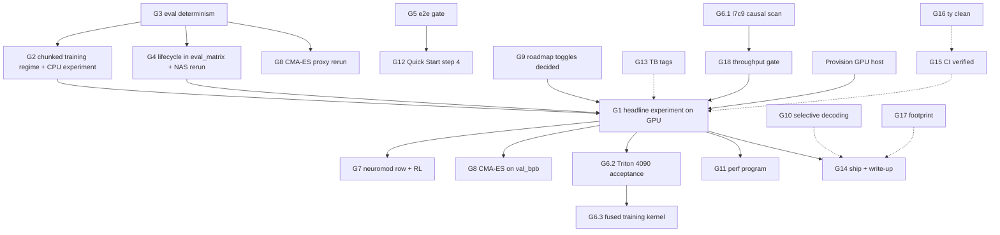

# Bridge Plan — bio_inspired_nanochat

**Reality check:** 2026-09-01 on `db544b2` (Phase 1 report: "Bio-Nanochat Reality Check").
**This document:** Phase 2 of `/reality-check-for-project` — one resolution per gap between what
the README promises and what the code delivers, ordered by vision impact, each with success
criteria, the "would the open beads close it?" answer, and the test that proves it.
**Consumer / gate / retirement:** read by the owner and by Phase 3a bead generation; it gates the
first GPU-hour spend (nothing below Phase B should run before the Phase A′ items are green); it
retires when every gap here is either a bead or closed.
**Status of the tracker:** 477 issues, 44 open, 4 in progress, 426 closed (`bv --robot-triage`).
**Rule the plan follows:** a number in a document must cite a committed artifact; a null result is a
result; nothing here creates a dashboard, certificate, or matrix that no code branches on.

---

## 0. What Phase A closed today (so the plan starts from the real state)

Commits `b95f574…e3f3ec4`, `5e88689…fb9762e`, `72a960f`, `c9659f1`, `871abfe`, all on `main`.

| Done | Evidence |
|---|---|
| CI unblocked (rustfmt hunk, both nightlies, release action, `--no-sync` everywhere) | `.github/workflows/*.yml`; runs for today's pushes are still **queued** on GitHub, so green is unverified |
| `--syn_cfg.<field>=<value>` typed overrides in `base_train`, refused on `--resume` and without `--synapses=1` | `bio_inspired_nanochat/cmaes_params.py`, `tests/test_syn_cfg_cli_overrides.py` |
| Homeostasis-guard flags and `--sm_health_mode=relative` (scale-free lifecycle health) | `synaptic_splitmerge.py`, `tests/test_lifecycle_health_relative.py`; measured on sx1m |
| `structural_every` no-op removed; Rust presyn decode dispatched behind `native_presyn` (1.98× at 512 keys, slower past 2k) | `tests/test_presyn_rust_dispatch.py` |
| Neuromodulatory bus registered as an ablation mechanism → 20-column matrix; `eval_matrix` runs every column | `ablation_registry.py`, `tests/test_neuromod_mechanism.py`, `tests/test_scaleup_ablation_e2e.py` |
| Registry redirected under pytest; 43 junk rows purged; **first ever `base_train` record** written (CPU smoke, 8 steps, `smoke_cpu`) | `results/registry.jsonl` run `672a84ae9eb7` |
| `base_train`/`mid_train` could not start on Python 3.14 (`torch.compile` raises) — gated; Quick Start training command runs end to end on two FineWeb shards | `scripts/base_train.py`, `scripts/mid_train.py`, checkpoint `~/.cache/bio_inspired_nanochat/base_checkpoints/smoke_cpu/` |
| Chat step verified against that checkpoint (`chat_cli -i base -g smoke_cpu`) | this session; README still documents `--source sft` only (G12) |
| Working-memory probes can read incrementally (`chunk_len`), the only regime in which online fast-weight writes can be seen; probes now read deterministically (`update_mem` split from `train_mode`) | `synthetic_tasks.py`, `gpt_synaptic.py`, `tests/test_working_memory_chunked_eval.py` |
| README, CHANGELOG, CLAIMS_AUDIT, TESTING, theory index, model zoo, RL study, CA-init corrected; unsupported numbers removed; 13 stale blocks cleared; 5 false closes reopened | those files; `.beads/` |

Still true: **no GPU run exists anywhere; no model larger than 2 layers × 64 dims has been trained;
the bio-vs-vanilla experiment has not started.** The dual-4090 host `trj` is unreachable from here.

---

## 1. Gap register

Severity is about the promise, not the code. "Beads?" answers: if every open bead were finished,
would this gap close? **Yes / Partial / No (NO BEAD)**.

| # | Gap | Vision items | Status | Severity | Beads? | Size |
|---|---|---|---|---|---|---|
| G1 | The headline experiment: bio vs vanilla at scale, with statistics | 12, 13, 19 | NOT STARTED (blocked: GPU host) | Critical | Yes — `hwxb.2.5→2.6→3.x→5.2→5.3→6.x`, `4fw`, `rwg`, `gzm` | XL |
| G2 | Online fast-weight efficacy: never shown; the probes were blind until today; no training regime lets the model learn to use the writes | 3 | UNPROVEN | Critical | Partial — `sx1m`, `hwxb.4.4`; the chunked training regime has NO BEAD | L |
| G3 | Evaluation determinism: `GPTSynaptic.forward` defaults to `train_mode=True` (stochastic release + plasticity), so every unwrapped evaluator scores a noisy, self-modifying model | 1, 2, 11, 12 | REGRESSED (contaminates past CPU results and future GPU evals) | Critical | NO BEAD | S |
| G4 | Structural lifecycle efficacy: defaults inert; NAS regressed on 8/8 seeds; `relative` health exists but no run has measured it | 5, 6 | UNPROVEN (evidence path built this evening: `structural_columns()`) | Major | Partial — `sx1m`, `hwxb.4.3`, `uta.2`; the NAS re-run has NO BEAD | M |
| G5 | A real end-to-end gate for the training scripts (the test that would have caught the `torch.compile` crash) | 14, 23 | DONE this evening — `tests/test_e2e_quick_start.py` | Major | closed by commit | S |
| G6 | Kernels: exact causal recurrence 12× slower (`l7c9`), Triton decode kernel never on a GPU (`3bnd`), fused training kernel (`jyb.2/3`), Rust row-parallel (`ylo2`) | 9, 10 | PARTIAL | Major | Yes | L–XL |
| G7 | Neuromodulation efficacy and the RL sample-efficiency study | 7 | UNPROVEN | Major | Yes — `hwxb.4.2`, `hy8.3` (GPU) | L |
| G8 | CMA-ES against a language-model objective | 11 | PARTIAL | Major | Yes — `idh4` | L |
| G9 | Roadmap features without an evidence path | 18 | RESOLVED 2026-09-02 (`74f.9`): 6 of 11 already have D1 columns; 1 is unimplemented, 1 a recipe knob, 3 are off-path research modules — README carries the table | Major | closed | M |
| G10 | Selective decoding / calibrated abstention unreachable from serving | 8 | PARTIAL | Major | Yes — `wmel` | M |
| G11 | Dual-4090 performance program (utilization, NCCL, precision, cudagraphs, guardrails) | 13 | NOT STARTED (GPU) | Major | Yes — `6pj`, `j9i`, `2fh`, `4nk`, `5rh`, `94r`, `h4j`, `vwl` | XL |
| G12 | Quick Start step 4 documented `--source sft` only; the working post-`base_train` command was undocumented | 14 | DONE this evening (README §4, CLI help) | Minor | closed by commit | S |
| G13 | TensorBoard tags the README promised (`calcium_mean`, `rrp_mean`, `fast_weight_norm`) were not emitted | 17 | CLOSED by the morning docs pass — README now lists only the tags NeuroViz emits | Minor | closed | S |
| G14 | Ship a usable checkpoint, demo, write-up; the 2025 publication milestone | 19, 20 | NOT STARTED (GPU) | Critical (it is the product) | Yes — `hwxb.6.1/6.2/6.3`, `vap.6` | L |
| G15 | CI/nightlies green **verified**, not just fixed | 23 | UNVERIFIED | Minor | NO BEAD | S |
| G16 | Type-check debt: 51 `ty` diagnostics, none in the changed-files gate | 23 | DEBT | Minor | NO BEAD | S |
| G17 | Package footprint: 27 test-only modules, dead `kernels/dispatcher.py`, orphan `metrics_fused.py` | 22 | DEBT | Minor | NO BEAD (deletion needs written permission) | M |
| G18 | Throughput cost: bio path 4–18× slower than vanilla at toy scale; no declared budget or gate | 9, 13 | UNBOUNDED | Major | Partial — `l7c9`, `6pj` | M |

Working and not in the register: 1, 2, 4 (presyn dynamics, stochastic release, bistable latch),
15 (retrofit), 16 (registry hygiene), 21 (docs current as of today).

---

## 2. Resolutions

### G3 · Evaluation determinism — REGRESSED → WORKING  *(do first: it changes what every other measurement means)*

**Current state.** `GPTSynaptic.forward(idx, targets=None, kv_cache=None, train_mode=True, …)`.
`train_mode` gates stochastic vesicle sampling (`stochastic_train_frac=0.12`) and persistent presyn
normalizer updates in attention, and `update_mem` (plasticity) in the MLP/MoE. `base_train`'s
validation wrapper and `eval_matrix` pass `train_mode=False`; `scripts/base_eval.py`,
`core_eval.py`, `scripts/e2e/fast_weight_comparison_bench.py`, `scripts/e2e/structural_nas_evaluation.py`,
`scripts/e2e/wake_sleep_consolidation.py`, `scripts/tune_bio_params.py`, `perf_regression.py`,
`self_correcting_generator.py` call `model(...)` with no `train_mode`. Measured today: two identical
eval-mode forwards differ by up to 0.067 in logits with the default; 0.0 with `train_mode=False`.
The fast-weight comparison null, the structural-NAS regression, and the CMA-ES proxy No-go were all
scored in this regime.

**Target state.** An `nn.Module` in eval mode is deterministic by default. `train_mode: bool | None =
None` resolves to `self.training`; explicit callers are unchanged (`base_train` passes `True` in the
loop, `False` in eval). Generation keeps adapting only where the Engine says so. *Landed this
evening (`5cb1a90`); the audit re-runs below are still open.*

**Success criteria.**
- [ ] `tests/test_eval_determinism.py`: for every evaluator entry point above, two calls on the same
  batch with an eval-mode synaptic model are bit-identical, and a training-mode forward with
  `stochastic_train_frac>0` is not.
- [ ] `test_eval_plasticity_isolation.py` still passes (validation cannot mutate `w_fast`).
- [ ] The CORE metric computed inside `base_train` is identical across two evaluations of the same
  checkpoint.
- [ ] The three CPU artifacts above are re-run once under the fixed default and their JSON files
  gain a `measurement_regime` field; the docs that cite them say which regime produced the number.

**Implementation.** (1) `gpt_synaptic.py`: default `train_mode=None → self.training`. (2) Run the full
suite; fix any test that relied on eval-mode plasticity by passing `update_mem=True` explicitly.
(3) Engine: assert it passes `train_mode` explicitly. (4) Re-run `fast_weight_comparison_bench`,
`structural_nas_evaluation`, `tune_bio_params` proxy once (CPU, minutes); commit the artifacts.

**Dependencies.** None. **Size.** S. **Vision goals.** 1, 2, 11, 12 (every metric). **Beads?** NO BEAD.

### G1 · The headline experiment — NOT STARTED → WORKING

**Current state.** Harness complete (`eval_matrix`, `eval_stats`, pre-registered D1 matrix with
synaptic-off anchor, registry, checkpoint manager, DDP path). Since this evening the commands that
produce every cell's checkpoint are derived from the spec (`scripts/matrix_launch.py`,
`ablation_matrix.base_train_argv`); before that nothing turned a column into a training run.
Zero GPU runs. `trj` unreachable.

**Target state.** D1 as pre-registered in `docs/ablation_matrix.md`: depth 10, ~91M tied params,
500M FineWeb-Edu tokens, 3 seeds, 20 columns, on 2×4090; verdict written by `eval_stats` with
paired tests and Holm correction; checkpoints and curves in the registry.

**Success criteria.**
- [ ] `hwxb.2.5` smoke on the GPU host: 200 steps, `val_bpb` finite, checkpoint saved and resumed
  bit-exactly (`hwxb.2.6` save→kill→resume proof).
- [ ] `hwxb.3.1/3.2` vanilla baseline: 3 seeds, all Phase-0 metrics in the registry.
- [ ] `hwxb.5.2` screening matrix, then confirmation; the go/no-go estimate committed before the run.
- [ ] `hwxb.5.3` verdict: for each mechanism, effect on `val_bpb` with CI and the throughput cost
  beside it. A null is a valid outcome and closes the bead.

**Implementation.** Provision (ssh entry for `trj` or a rented 2×4090/A100), fetch FineWeb-Edu +
CORE bundle once, then execute the bead chain in order. Only after G3, G2-regime, G4-wiring are
green, or the run measures the wrong defaults.

**Dependencies.** G3; G2 (training regime); G4 (matrix wiring); G5. **Size.** XL. **Vision goals.**
12, 13, 19. **Beads?** Yes — the chain exists and is correct.

### G2 · Online fast-weight efficacy — UNPROVEN → MEASURED

**Current state.** Mechanism live by default; ON vs OFF held-out loss identical to six decimals
(hwxb.4.4); Δw_fast ≈ 1e-7. Root cause found today: every probe ran one full teacher-forced
forward, in which the writes land after the matmuls that would need them — the measurement could
not see the mechanism. `retrieval_accuracy(chunk_len=k)` now reads incrementally and the writes
provably change later logits (`test_hebbian_writes_land_once_per_chunk_and_become_visible`). Training
still runs full forwards, so the slow weights never learn to *use* the scratchpad.

**Target state.** A chunked training regime: the sequence is forwarded in `k`-token chunks through a
KV cache, deferred writes land between chunks, the loss is summed over chunks and backpropagated
through the slow weights once per sequence. Exposed as `--hebb_chunk_len` in `base_train` and
`eval_matrix`'s inline loop; recorded in `run_config`.

**Success criteria.**
- [ ] Unit: chunked training loss on a synaptic model with Hebbian OFF equals full-forward loss
  (tolerance 1e-5); with Hebbian ON, `w_fast` changes between chunks inside one sequence.
- [ ] CPU experiment, 2L/64d, 5 seeds, associative recall 2–16 pairs, 2k steps: ON vs OFF recall
  accuracy under chunked reading. Predeclared: effect = ON − OFF; countermetric = tokens/s ratio
  chunked/full. **Either** ON > OFF by ≥ 3σ at ≥ 8 pairs, **or** the README's "infinite local
  context" is demoted to a hypothesis and `enable_hebbian` moves to the add-one-in set.
- [ ] Control: the same models read with a full forward show ON ≈ OFF (proves the regime matters).
- [ ] `docs/online_learning_status.md` rewritten from the artifacts; `sx1m`/`sax.1` commented.

**Implementation.** `GPTSynaptic.forward_chunked(idx, targets, chunk_len)` (reuses `KVCache`; no
new module); `base_train`/`eval_matrix` flag; `scripts/e2e/hebbian_chunked_regime.py` producing a
committed JSON; three-factor gating (`hy8.2`, closed) switched on in the ON arm as a second column.

**Dependencies.** G3. **Size.** L. **Vision goals.** 3. **Beads?** Partial — `sx1m` names the
problem, `hwxb.4.4` is GPU-scale; the regime itself has NO BEAD.

### G4 · Structural lifecycle efficacy — UNPROVEN → MEASURED

**Current state.** Controller wired in `base_train` (`--splitmerge_every`, `--sm_health_mode`);
product health peaks at half the routing mass so uniform experts read as dying; `relative` mode
measured on sx1m (separates a real straggler at E=16). The lifecycle is a `base_train` knob, not a
`SynapticConfig` field, so until this evening no matrix column could carry it;
`ablation_matrix.structural_columns()` now defines the opt-in pair `moe_fixed` vs `moe_splitmerge`
(bio_all on `SynapticMoE`; split/merge every 100 steps under `relative` health) and
`scripts/matrix_launch.py --stage structural` emits their `base_train` commands. The one NAS
evaluation regressed (p=0.0036) and was scored under the G3 regime.

**Target state.** The pair trained and scored like any other cell (screening budget, 2 seeds), and
the NAS evaluation re-run under G3 with both health modes.

**Success criteria.**
- [x] The `moe_splitmerge` command carries `--splitmerge_every=100 --sm_health_mode=relative
  --split_health_min=1.5 --merge_health_max=0.35` and both columns share `bio_all`'s
  `SynapticConfig` (`tests/test_matrix_launch.py`).
- [ ] CPU pilot of the pair at 2L/64d, 300 steps, 3 seeds: events fire (≥1 split, ≥1 merge) under
  `relative` health during ordinary training, loss finite.
- [ ] `structural_nas_evaluation` re-run (8 seeds) under `relative` health: report final-loss delta
  with CI. If still worse, split/merge stays opt-in and the README says so in the lifecycle section.
- [ ] `sx1m` closed with the numbers, whichever way they fall.

**Dependencies.** G3. **Size.** M. **Vision goals.** 5, 6. **Beads?** Partial — `sx1m`, `hwxb.4.3`,
`uta.2`; the NAS re-run has NO BEAD.

### G5 · A real end-to-end gate for the training scripts — NO TEST → WORKING

**Current state.** 1,789 tests, none of which runs `scripts.base_train` as the user does; the
harness tests import pieces. `torch.compile` on 3.14 killed the script at line 564 for months.

**Target state.** One subprocess test (marked `e2e`, ~60 s CPU) runs `python -m scripts.base_train
--synapses=1 --depth=1 --num_iterations=2 …` on a 200-document synthetic parquet + 512-token
tokenizer built in `tmp_path`, then `chat_cli -i base -p "x"` on the result. CI runs it.

**Success criteria.**
- [ ] Test asserts: exit 0, a `model_*.pt` and `meta_*.json` exist, one registry row with
  `harness == "train"` in the temp registry, a non-empty generation.
- [ ] Planted negative: with `--syn_cfg.bogus=1` the process exits non-zero with the field name.

**Dependencies.** None. **Size.** S. **Vision goals.** 14, 23. **Beads?** NO BEAD.

### G6 · Kernels — PARTIAL → ACCEPTED

**Current state.** Exact causal recurrence 12× slower after the 08hm correctness fix (`l7c9`, P1);
Triton FP32 Tq=1 decode kernel real but never executed on a GPU (`3bnd`); Rust decode dispatched on
CPU, loses past 2k keys (`ylo2`); fused training kernel and backward designed, not built (`jyb.2/3`).

**Target state.** In order of leverage: (1) `l7c9` — a vectorized exact causal scan (associative
scan over the calcium/buffer recurrence, blocked by `recurrence_block_size`) with decode parity kept
by `test_e2e_decode_parity`; target ≤ 2× the pre-08hm path on CPU. (2) `3bnd` on the 4090 with the
existing `benchmark_presyn_live`. (3) `jyb.2/3` only if the D1 verdict keeps presyn.

**Success criteria.**
- [ ] `l7c9`: parity tests green; `perf_regression` gate records the new ratio.
- [ ] `3bnd`: kernel output equals reference to 1e-5 on 4090; speedup table committed.

**Dependencies.** G1 (GPU) for (2)(3); none for (1). **Size.** L/XL. **Vision goals.** 9, 10.
**Beads?** Yes.

### G7 · Neuromodulation — UNPROVEN → MEASURED

**Current state.** Registered as `add_neuromod` in the matrix today; the bus is instantiated by the
harness; the unsupported "1.72×" numbers were removed. `hy8.3` (RL study) open, GPU.

**Target state.** Its effect appears as one row of the D1 verdict (G1); the RL study runs against
a real reward with a predeclared denominator (samples to reach a fixed reward, 3 seeds).

**Success criteria.** D1 row with CI; `hy8.3` artifact committed or the bead closed as null.
**Dependencies.** G1. **Size.** L. **Vision goals.** 7. **Beads?** Yes.

### G8 · CMA-ES on a language-model objective — PARTIAL → RUN

**Current state.** CLI real; one Phase-1 run on a synthetic proxy (No-go, gain within seed noise,
scored under G3). `idh4` open.

**Target state.** Phase 1 re-run on the fixed proxy under G3 (CPU), then against `val_bpb` on the
D1 small config (GPU), with the 74f.1 readiness gate.

**Success criteria.** Committed `results/cmaes_phase1_*.json` with seed-noise floor beside the gain;
README §CMA-ES cites it. **Dependencies.** G3; G1 for the LM objective. **Size.** L. **Vision.** 11.
**Beads?** Yes — `idh4`.

### G9 · Roadmap toggles with no evidence path — DECIDED (2026-09-02)

*Outcome:* the premise was half wrong. Six of the eleven roadmap features are registered mechanisms
with D1 columns (stochastic release, septin barrier, Doc2, Xi genome, the bistable latch, and the
endocytosis queue through `bio_no_presyn`); Rab/SNARE routing is not implemented; CA init is a
training-recipe knob; gauge-reversible, simplicial and ultrametric are research modules `GPTSynaptic`
does not import. README §Roadmap now carries the per-feature evidence table. No new columns were
added: nothing off the live path can be ablated. The original analysis follows for the record.

**Current state.** Endocytosis buffer, septin, Rab/SNARE, Doc2, Xi genome, CA init, gauge-reversible,
simplicial, ultrametric, tropical skeleton, topological NAS exist as config fields; nine mechanisms
have add-one-in columns; these eleven have none, so no planned run will ever produce evidence for
them.

**Target state.** For each: (a) if it is a `SynapticConfig` toggle, add it to `MECHANISMS` with its
prerequisites so `add_one_in()` derives a column, and accept the matrix growing; or (b) mark it
`exploratory` in the registry and in README §Roadmap with "no efficacy evidence planned".

**Success criteria.** `test_scaleup_ablation_e2e::test_module_enumerates_the_full_matrix` updated to
the new count; README roadmap table has an Evidence column with one of {D1 column, exploratory}.
**Dependencies.** None (config-only). **Size.** M. **Vision.** 18. **Beads?** NO BEAD.

### G10 · Selective decoding in serving — PARTIAL → WORKING

**Current state.** `quality_guarded_predict` exists; unreachable from `Engine.generate`, `chat_cli`,
`chat_web`. Calibration numbers come from a 1-layer toy and are labeled so.

**Target state.** `Engine.generate(..., selective=True)` routes through it; `chat_web` exposes a
toggle; abstentions are visible in the response.

**Success criteria.** Test: with a planted low-confidence step the engine abstains; with `selective`
off the output is unchanged. **Dependencies.** None. **Size.** M. **Vision.** 8. **Beads?** Yes — `wmel`.

### G11 · Dual-4090 performance — NOT STARTED → MEASURED

**Current state.** Nine perf beads, all GPU-gated; zero measurements.
**Target state.** `j9i` profiling harness first; then hotspot order. **Success criteria.** A committed
`perf_baselines.json` with GPU rows; a CI perf guardrail that fails on >10% regression of tok/s.
**Dependencies.** G1 provisioning. **Size.** XL. **Vision.** 13. **Beads?** Yes.

### G12 · Quick Start step 4 — PARTIAL → WORKING

**Current state.** README §4 gives `chat_web --source sft`; after §3 only a base checkpoint exists.
`load_model` accepts `base`; the CLIs' help strings say `sft|mid|rl`.
**Target state.** §4 shows `chat_cli -i base -g <model_tag>` (and the `chat_web --source base`
form) with the note that a base model completes text rather than chats; help strings list `base`.
**Success criteria.** Covered by the G5 e2e test. **Dependencies.** None. **Size.** S. **Beads?** NO BEAD.

### G13 · TensorBoard tags — CLOSED

Re-checked against HEAD: the README's "Key metrics to watch" already names only the tags
NeuroViz emits (`<layer>/energy_mean`, `health_mean`, `util_mean`, `dead_expert_frac`,
`camkii_mean`); the morning docs pass removed the three promised-but-missing names. Emitting
calcium/RRP means and the fast-weight norm from `GPTSynaptic._last_presyn_state` and
`SynapticLinear.w_fast` would be a 30-line addition if anyone wants the channels; nothing is
promised that is not delivered. **Vision.** 17.

### G14 · Ship it — NOT STARTED → SHIPPED

**Current state.** No checkpoint exists. `hwxb.6.1–6.3`, `vap.6` open.
**Target state.** The D1 winner (or the vanilla baseline plus an honest null) trained to the final
recipe, checkpoint hash in `docs/model_zoo.md`, demo command in README, write-up with the verdict
table — positive or null — replacing the 2025 milestones.
**Success criteria.** `python -m scripts.chat_cli -i base -g <tag>` on a fresh clone reproduces the
documented sample; `results/registry.jsonl best --metric val_bpb` returns it.
**Dependencies.** G1. **Size.** L. **Vision.** 19, 20. **Beads?** Yes.

### G15 · CI verified green — UNVERIFIED → VERIFIED

Runs for every push today are queued. **Success criteria.** One green `ci.yml` and one green
nightly on `main`, linked from TESTING.md. If the runner backlog persists 48 h, add a self-hosted
runner on the GPU host (which G1 needs anyway). **Size.** S. **Beads?** NO BEAD.

### G16 · Type-check debt — DEBT → CLEAN

51 `ty` diagnostics (`ty check --output-format concise`): optimizer-group typing in `gpt.py` /
`gpt_synaptic.py` / `adamw.py` / `muon.py` (13), `perf_regression.py` `Tensor | Module` unions (5),
`neuroviz.py` (4), `deliberation.py` (4), the `base_train` eval wrapper (4), `benchmark_flex.py` (3),
test files (18). The changed-files gate hides them. **Success criteria.** `uv run ty check` exits 0
and CI runs it on the whole tree. **Size.** S (one afternoon). **Beads?** NO BEAD.

### G17 · Footprint — DEBT → HONEST

27 modules imported only by tests; `kernels/dispatcher.py` imported by nothing; `metrics_fused.py`
orphaned. **Target.** Quarantine test-only modules under `bio_inspired_nanochat/experimental/`;
delete the two dead files **only with written permission** (AGENTS.md rule 1). README's footprint
sentence matches the import graph. **Size.** M. **Beads?** NO BEAD.

### G18 · Throughput budget — UNBOUNDED → GATED

Bio path 4–18× slower than vanilla at toy scale (`perf_baselines.json`). **Target.** Declare the
budget the project accepts (proposal: ≤ 2.0× training, ≤ 1.5× decode at D1 scale after `l7c9`) in
README §Performance, and make `perf_regression` fail above it. **Success criteria.** The gate fails on
a planted 3× slowdown and passes at HEAD. **Dependencies.** G6(1). **Size.** M. **Beads?** Partial.

---

## 3. Order of work and dependencies

**Phase A′ (CPU, this week, in this order):** G3 → G5 → G12 → G2 → G4 → G9 → G6.1 → G18 → G10
→ G16 → G17. Everything here is doable on this host; G2 and G4 produce the numbers that decide
which defaults the GPU run should carry.

**Phase B (GPU host):** Provision → `hwxb.2.5` → `hwxb.2.6` → `hwxb.3.1/3.2` → `hwxb.5.2` →
`hwxb.5.3` → `hwxb.6.x`; in parallel `j9i` → `3bnd` → `6pj` items; `hy8.3`; `idh4`; `74f.6`.

**Phase C:** footprint and packaging (`vap.6`).

## 4. Would finishing the open beads close the vision?

For the headline question: **yes, once a GPU exists** — the `hwxb` chain is the pre-registered
experiment and the harness is done. For the vision as written: **no.** Five open gaps have no bead
(G3's audit re-runs, G9, G15, G16, G17; G5, G12 and G13 are closed), two are only partially
covered (G2's training regime, G4's NAS re-run), and one is a policy decision (G18). Phase 3a
should create beads for exactly those eight items; the rest already have correct beads and need
no new tracker entries.

## 5. Verification plan (how each vision item is proven when the plan is done)

| Vision item | Proof |
|---|---|
| 3 Fast weights give within-sequence memory | G2 artifact: ON−OFF ≥ 3σ under chunked reading, ≈0 under full reading, 5 seeds |
| 5–6 Lifecycle grows capacity where demanded | G4 artifact: events fire in healthy training; final-loss delta with CI, both health modes |
| 7 Neuromodulation helps | D1 `add_neuromod` row with CI |
| 8 Calibrated abstention in serving | G10 test; `chat_web` toggle |
| 9–10 Kernels | `test_e2e_decode_parity`, `benchmark_presyn_live` on 4090, perf table |
| 11 CMA-ES gain | `results/cmaes_phase1_*.json` with seed-noise floor |
| 12 Bio vs vanilla with statistics | `eval_stats` verdict table on D1, committed |
| 13 Dual-4090 performance | GPU rows in `perf_baselines.json`; guardrail in CI |
| 14 Quick Start | G5 subprocess test in CI |
| 17 TensorBoard vitals | README lists only emitted tags (checked at HEAD, 2026-09-01) |
| 18 Roadmap features | Evidence column: D1 column or "exploratory" |
| 19–20 Checkpoint + write-up | `chat_cli` reproduces the documented sample on a fresh clone |
| 22–23 Docs and CI | green run links in TESTING.md; `ty check` exit 0 |
| all | every number in README cites a file under `results/` or `docs/` that the test suite can load |

## 6. What this plan refuses to do

No new certificate, ledger, or dashboard: the registry, `eval_stats`, and pytest are the only
recording surfaces. No metric without a predeclared denominator and a countermetric (throughput
beside every quality number). No closing a bead on a proxy: GPU-acceptance beads close on GPU
artifacts. Null results close beads and go into the README.
